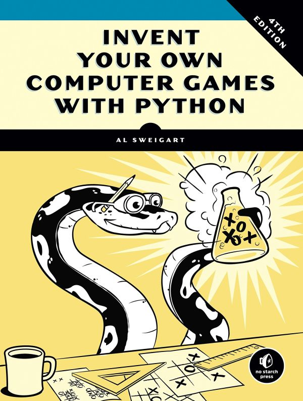
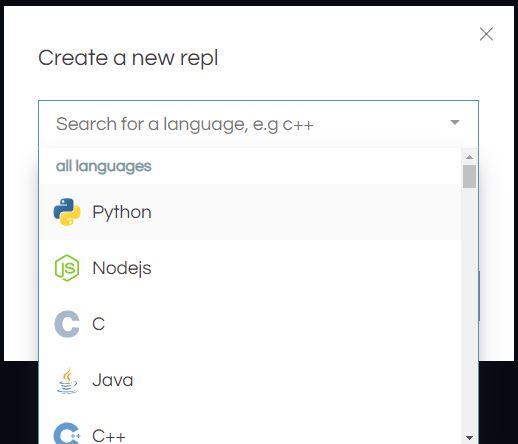

# Python Treasure Hunt

This is a tutorial on building a MineSweeper-like game called Sonar Treasure Hunt. Rather than playing it in a GUI with a point and click interface, we'll be doing it in the console.

Programming text-based games is a relatively common part of coding interviews. It tests a number of basic coding skills and the console is the great equalizer.

We'll be using a slide-based deck in the workshop, but keep this window open as it will correlate with the slides and give you more details than the slides.

## Slide 01: Opening Slide

This shows as you're all filing in. Please get online and go to https://REPL.it and the bit.ly link goes to this github repository. We'll be using this as our online coding environment for Python.

## Slide 02: Welcome

The exercise we're doing, "Sonar Treasure Hunt" is by Al Sweigart, from his book "[Invent Your Own Computer Games with Python - 4th Edition](https://inventwithpython.com/invent4thed)." It is used with permission thanks to his Creative Commons licensing on all his books. This presentation borrows liberally from his code and text.




We are using **Chapter 13** of the book, so if you're a beginner with Python, this workshop isn't for you. We'll deal with middle school math (Cartesian coordinates and the Pythagorean Theorem), data structures (which are variables that hold other variables), and Python methods for manipulating strings and data structures.

Here's a working version (just copying Al Sweigart's final code): [play the game](https://repl.it/repls/PrevailingEasygoingAdministrators)


## Slide 03: Repl.it

Please go to [repl.it](https://repl.it) and click the "+new repl" button.


Select Python.



Then click the "Create repl" button. The result will be a Python programming environment and runtime. We're ready to start coding.

## Slide 4: Demo 1

We'll be creating a Sonar Treasure Hunt game. The game will draw our oceanscape and hide treasure chests in it. 

When we put a sonar device down, it will tell us  the distance to nearby treasure chests, but not the direction.

## Slide 5: Demo 2

If we put down multiple devices, the combined data can help us triangulate the position of a treasure chest.

## Slide 6: Cartesian Coordinates 1

Let's get the math out of the way. Cartesian Coordinates are a point's place on a grid. A flat, or two-dimensional grid will have two axes: the x-axis that goes left to right, and the y-axis that goes up and down. If you've done Scratch, you're probably pretty familiar with this.

Where the two axes cross is the coordinate 0,0.

## Slide 7: Cartesian Coordinates 2

If you move away from the the center, the numbers change to measure how many units away.

This second dot is at 3,4, We say it in that order, because we usually say X first, then Y.

## Slide 8: Lists

Lists are variables that can hold multiple other variables, including other lists.

```python
x = [] # empty list
y = [ "potato" , 78 , "hut" , "hike" ]
z = [ [ 1 , 2 ] , ["apple" , "orange"] ]
```

Lists start counting at 0. 

`y[0]`'s value is "potato".

`z[1][0]`'s value is "apple".

Note how there's a comma between each item in a list.

## Slide 9: Let's get programming

First we're going to import the modules from the SPL (Standard Python Library) that we'll need.

We've got `random` for generating random numbers (which we'll need almost right away), math for doing more advanced math to figure out how far away our sonars are from our treasure chests, and sys for a system operation to end the program when all is said and done.

Then we have our first function. It's going to create the ocean for our game board.

It's going to create a board 60 characters wide by 15 high. Let's look at the code

```python
# Sonar Treasure Hunt

import random
import sys
import math

def getNewBoard():
    # Create a new 60x15 board data structure.
    board = []
    for x in range(60): # The main list is a list of 60 lists.
        board.append([])
        for y in range(15): 
            # Each list in the main list has 15 single-character strings.
            # Use different characters for the ocean to make it more readable.
            if random.randint(0, 1) == 0:
                board[x].append('~')
            else:
                board[x].append('`')
    return board
```

The board data structure is a list of lists of strings. The first list represents the x-coordinate. Since the game’s board is 60 characters across, this first list needs to contain 60 lists. After we create the `board` list, we create a for loop that will append 60 blank lists to it.

But board is more than just a list of 60 blank lists. Each of the 60 lists represents an x-coordinate of the game board. There are 15 rows in the board, so each of these 60 lists must contain 15 strings. Within that is another for loop that adds 15 single-character strings that represent the ocean.

The ocean will be a bunch of randomly chosen '~' and '\`' strings. The tilde (~) and backtick (\`) characters—located next to the 1 key on your keyboard—will be used for the ocean waves. To determine which character to use, we apply this logic: if the return value of random.randint() is 0, add the '~' string; otherwise, add the '\`' string. This will give the ocean a random, choppy look.

## Slide 10: The Raw Ocean

We can see the board data we generated, by using the line:

```python
print(getNewBoard())
```

The result looks like a bunch of lines like this, but with no line breaks...

['~', '~', '~', '~', '\`', '~', '~', '~', '\`', '\`', '~', '\`','\`', '\`', '~']

## Slide 11: Let's turn that into a game board

```python
def drawBoard(board):
    # Draw the board data structure.
    tensDigitsLine = '    ' 
    # Initial space for the numbers down the left side of the board
    for i in range(1, 6):
        tensDigitsLine += (' ' * 9) + str(i)

    # Print the numbers across the top of the board.
    print(tensDigitsLine)
    print('   ' + ('0123456789' * 6))
    print()

    # Print each of the 15 rows.
    for row in range(15):
        # Single-digit numbers need to be padded with an extra space.
        if row < 10:
            extraSpace = ' '
        else:
            extraSpace = ''

        # Create the string for this row on the board.
        boardRow = ''
        for column in range(60):
            boardRow += board[column][row]

        print('%s%s %s %s' % (extraSpace, row, boardRow, row))

    # Print the numbers across the bottom of the board.
    print()
    print('   ' + ('0123456789' * 6))
    print(tensDigitsLine)
    
# How could you print the game board?
```

The drawing in the `drawBoard()` function has four steps:

1. Create a string variable of the line with 1, 2, 3, 4, and 5 spaced out with wide gaps. These numbers mark the coordinates for 10, 20, 30, 40, and 50 on the x-axis.
2. Use that string to display the x-axis coordinates along the top of the screen.
3. Print each row of the ocean along with the y-axis coordinates on both sides of the screen.
4. Print the x-axis again at the bottom. Having coordinates on all sides makes it easier to see where to place a sonar device.

## Slide 12: The formatted board

Of course we removed the line to print the raw board data, but now we can print a formatted game board.

```python
board = getNewBoard()
print(drawBoard(board))
```

## Slide 13: Place some chests

```python
def getRandomChests(numChests):
    # Create a list of chest data structures 
    # (two-item lists of x, y int coordinates).
    chests = []
    while len(chests) < numChests:
        newChest = [random.randint(0, 59), random.randint(0, 14)]
        if newChest not in chests: 
            # Make sure a chest is not already here.
            chests.append(newChest)
    return chests

# Look at the coordinates of your chests?
```

We create another list called chests. 

Then we create a loop to fill it. But notice that the loop is based on the number of items in the list... while `len(chests)` (the length of the list) is less than the number we want, we'll keep running it. 

We next generate a random coordinate that is itself a list of two values (the x and y), but then we only add it if that value is not in the list.

That iteration of the loop ends whether we added a coordinate to the list or not. If we don't have enough coordinates, it runs again.

What might happen if we made the number big? Say half the number of spaces on the game board?

What if we made the number of chests bigger than the number of spaces on the game board?

## Slide 14: Show the chests

```python
print(getRandomChests(3))
```

This will only print the list of chest positions. Can you visualize where they'd be on the game board?

## Slide 15: Show the chests 2

Now let's actually place some little treasure chest graphics on the board. Are they where you thought they'd be?

## Slide 16: A little housekeeping

Some functions do big things. Some perform little checks. This one is tiny. It just makes sure the move that was entered was within the bounds of the board. We'll just include it with the next block when it's lab time.

## Slide 17: The Pythagorean theorem

Way back in Ancient Greece, a mathematician named Pythagoras figured out something cool. If you took the lengths of all the lines and multiplied them by themselves to get their squares, the base's square plus the height's square would always equal the hypotenuse's square. 

Which means if you know the base and the height, you don't need to take a ruler and measure the hypotenuse. You could *derive* it mathematically.

If we know how far from our sonar buoy a treasure chest is in X and Y (our base and height), we can mathematically derive the hypotenuse to tell the player how far their sonar buoy is from a chest. If it's four up and three over, it's five away.

## Slide 18: Handling a Player Move

```python
def makeMove(board, chests, x, y):
    smallestDistance = 100 # Any chest will be closer than 100.
    for cx, cy in chests:
        distance = math.sqrt((cx - x) * (cx - x) + (cy - y) * (cy - y))

        if distance < smallestDistance: # We want the closest treasure chest.
            smallestDistance = distance

    smallestDistance = round(smallestDistance)

    if smallestDistance == 0:
        # xy is directly on a treasure chest!
        chests.remove([x, y])
        return 'You have found a sunken treasure chest!'
    else:
        if smallestDistance < 10:
            board[x][y] = str(smallestDistance)
            return 'Treasure detected at a distance of %s from the sonar device.' % (smallestDistance)
        else:
            board[x][y] = 'X'
            return 'Sonar did not detect anything. All treasure chests out of range.'
```

This may seem complicated, so we'll step through it.

This function is getting the board list, the chests list, and the move to evaluate. 

First we'll set a big "smallest distance" variable that we'll keep replacing as we check the distance from the move to the chests.

We're going to find the *closest* chest by running through the list of chests, getting the X/Y difference between the chest's position and the sonar buoy, then using the Pythagorean Theorem to determine the distance. 

NOTE: Here's where we use the math module we imported at the beginning, to use its square root function.

If the chest we evaluated is closer than the "smallest distance," we'll change the number to that.

Quick math question... who knows why we'll never get a negative number for the distance even if one or both of the X and Y differences are negative?

What happens when you square a negative number? The square is positive. So A squared plus B squared will always be positive and the square root of that will be positive as well.

So now we have the closest chest. If it's zero away, they found a chest!!!!

If it's less than 10 away (between 1 and 9), we put the number where we placed the sonar buoy.

If it's neither a direct hit or 1-9 away, we put an X there.

And we do this by changing the value of that space in the list of our board data, then it all gets redrawn...

No lab here... we're going to power through the rest of the code, then have a lab and a few questions while we play the game.

## Slide 19: Getting a player move

How do we get the player's choice?

```python
def enterPlayerMove(previousMoves):
    # Let the player enter their move. Return a two-item list of int xy coordinates.
    print('Where do you want to drop the next sonar device? (0-59 0-14) (or type quit)')
    while True:
        move = input()
        if move.lower() == 'quit':
            print('Thanks for playing!')
            sys.exit()

        move = move.split()
        if len(move) == 2 and move[0].isdigit() and move[1].isdigit() and isOnBoard(int(move[0]), int(move[1])):
            if [int(move[0]), int(move[1])] in previousMoves:
                print('You already moved there.')
                continue
            return [int(move[0]), int(move[1])]

        print('Enter a number from 0 to 59, a space, then a number from 0 to 14.')
```

Let's look at how this flows. We print a question... "where do you want to drop the next sonar device?" and offer them their choices to enter a coordinate or "quit."

We start a "while True" loop. And this is one of those things that always gets me with Python, because it expects you to capitalize True while a lot of other languages don't.

But a While True loop is an endless loop and it will keep running until we break it.

`move = input()` will wait for input from the terminal.

First we check if the user entered "quit". If they did, we break the loop by using the sys module's exit function to end the program. Remember how we imported the sys module at the beginning?

If they didn't enter "quit", we split the string into a list using the `split()` method of the string. If we don't specify a separator, it uses the space as a separator. So "1 14" would be split into ["1", "14"].

We make sure there are only two values, they're both digits, and the combo fits on the board.

Then we check to see if the player made that move before by checking if the move is in the list of previous moved. If they did, we say "you already moved there" then "continue" starts the loop over.

If the move is valid and not the same as an old one, we return the move value which breaks the while True loop.

If the move isn't 'quit' and isn't valid, we remind the player how to enter a move and let the loop restart naturally.

## Slide 20: Almost there... Instructions

```python
def showInstructions():
    print('''Instructions:
You are the captain of the Simon, a treasure-hunting ship. Your current mission
is to use sonar devices to find three sunken treasure chests at the bottom of
the ocean. But you only have cheap sonar that finds distance, not direction.

Enter the coordinates to drop a sonar device. The ocean map will be marked with
how far away the nearest chest is, or an X if it is beyond the sonar device's
range. For example, the C marks are where chests are. The sonar device shows a
3 because the closest chest is 3 spaces away.

1 2 3
012345678901234567890123456789012

0 ~~~~`~```~`~``~~~``~`~~``~~~``~`~ 0
1 ~`~`~``~~`~```~~~```~~`~`~~~`~~~~ 1
2 `~`C``3`~~~~`C`~~~~`````~~``~~~`` 2
3 ````````~~~`````~~~`~`````~`~``~` 3
4 ~`~~~~`~~`~~`C`~``~~`~~~`~```~``~ 4

012345678901234567890123456789012
1 2 3
(In the real game, the chests are not visible in the ocean.)

Press enter to continue...''')
    input()

    print('''When you drop a sonar device directly on a chest, you retrieve it and the other
sonar devices update to show how far away the next nearest chest is. The chests
are beyond the range of the sonar device on the left, so it shows an X.

1 2 3
012345678901234567890123456789012

0 ~~~~`~```~`~``~~~``~`~~``~~~``~`~ 0
1 ~`~`~``~~`~```~~~```~~`~`~~~`~~~~ 1
2 `~`X``7`~~~~`C`~~~~`````~~``~~~`` 2
3 ````````~~~`````~~~`~`````~`~``~` 3
4 ~`~~~~`~~`~~`C`~``~~`~~~`~```~``~ 4

012345678901234567890123456789012
1 2 3

The treasure chests don't move around. Sonar devices can detect treasure chests
up to a distance of 9 spaces. Try to collect all 3 chests before running out of
sonar devices. Good luck!

Press enter to continue...''')
    input()
```

This is a function that prints the instructions, then waits for the player to hit enter. A lot of lines, but really simple.

## Slide 21: The GAME LOOP

The game loop ties all these functions together and runs them over and over until the player wins, loses, or quits.

```python
print('S O N A R !')
print()
print('Would you like to view the instructions? (yes/no)')
if input().lower().startswith('y'):
    showInstructions()

while True:
    # Game setup
    sonarDevices = 20
    theBoard = getNewBoard()
    theChests = getRandomChests(3)
    drawBoard(theBoard)
    previousMoves = []

    while sonarDevices > 0:
        # Show sonar device and chest statuses.
        print('You have %s sonar device(s) left. %s treasure chest(s) remaining.' % (sonarDevices, len(theChests)))

        x, y = enterPlayerMove(previousMoves)
        previousMoves.append([x, y]) # We must track all moves so that sonar devices can be updated.

        moveResult = makeMove(theBoard, theChests, x, y)
        if moveResult == False:
            continue
        else:
            if moveResult == 'You have found a sunken treasure chest!':
                # Update all the sonar devices currently on the map.
                for x, y in previousMoves:
                    makeMove(theBoard, theChests, x, y)
            drawBoard(theBoard)
            print(moveResult)

        if len(theChests) == 0:
            print('You have found all the sunken treasure chests! Congratulations and good game!')
            break

        sonarDevices -= 1

    if sonarDevices == 0:
        print('We\'ve run out of sonar devices! Now we have to turn the ship around and head')
        print('for home with treasure chests still out there! Game over.')
        print(' The remaining chests were here:')
        for x, y in theChests:
            print(' %s, %s' % (x, y))

    print('Do you want to play again? (yes or no)')
    if not input().lower().startswith('y'):
        sys.exit()
        
```

Let's run through what this does. Then we'll copy the whole thing into your REPL and try a few labs with the game... and play it.

First we introduce the game and ask the player if they want instructions. If they do, we show them. Notice how the test of whether they do is that we convert everything they type into lowercase and test if the string starts with a lowercase y. They could type "yellow" or "yeah, no" and they'd get the instructions. They could type the Gettysburg Address instead of "no" and skip them.

Now we start a While True loop again. This is our game loop and we'll call it out "outer loop." It will run until the player quits, breaks execution, or chooses not to play again at the end of a game.

The outer loop sets up the start conditions for the game... 20 devices, 3 chests, clean new board, draws it for the first time, and sets up "previousMoves" as an empty list.

Then it starts an "inner loop" that will run so long as the player has sonar devices or it's broken.

The inner loop shows how many sonar devices and chests the player has left, then gets their move.

The inner loop checks their move result, which updates the board. If the result is false, it jumps to the end of the loop and starts it over, which is weird, because that function should always return some result.

If they found a chest, it updates all the previously dropped sonar devices with the new closest chest.

Then it draws the latest version of the board, tells the player which result they had (hit, distance from latest sonar to closest chest, or no chests in range).

It checks to see if they won with this move. If the player did, it prints a congratulatory message and breaks the inner loop. If not, it takes a sonar device out of inventory and then runs the inner loop (which only runs if the player has sonar devices left).

After the inner loop ends, either because a win broke it or the player ran out of sonar devices, it checks to see if the player has any sonar devices left. If they don't, it tells them they lost.

QUESTION: Why won't it tell the player they lost if they hit the last chest with their last sonar device?

Because if the player wins, the inner loop breaks before the last sonar device is removed from their inventory.

The game asks the player if they want to play again and checks if their answer starts with Y. If it does, the outer loop runs again, setting up a new game board, new treasure chest locations, etc. If not, `sys.break()` breaks the outer loop and the game ends.


## Slide 22: Get the game running

The slide shows the link to this repository. You can copy the full game out of the [fullgame.py](fullgame.py) file.

## Slide 23: Brain Teasers

We have four brain teasers to end the workshop. "**Of** **each** **of** **these,** **would it be easy or hard to change it?**"

1: The number of chests?

​	Easy, It's set with a variable.

2: The number of sonar devices?

​	Also easy, they're set with a variable.

3: The game board size?

​	Hard. Its values are hard-coded into the game board creation and drawing routines. You would need to do a not insignificant amount of refactoring to make those be controlled by variables.

4: The Pythagorean theorem?

​	Trick question. It's math. You can't change it.

Thanks for coming. Hope you had fun.